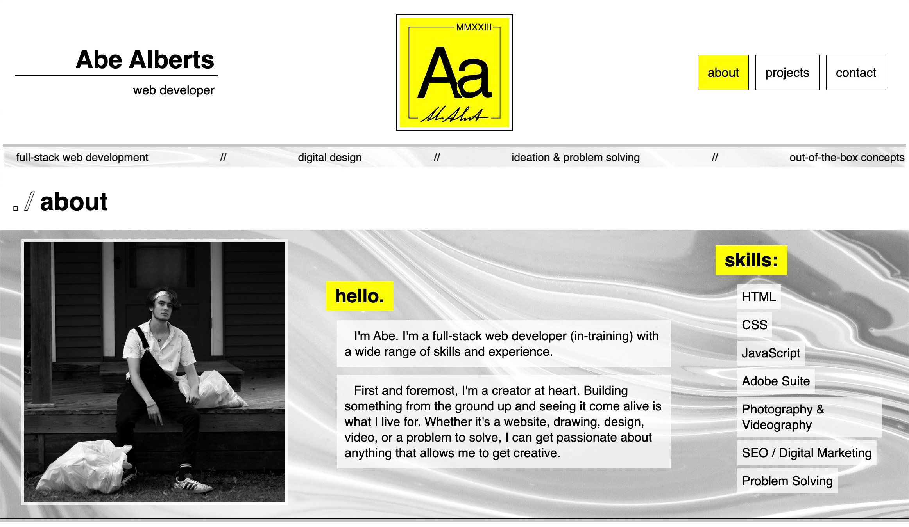
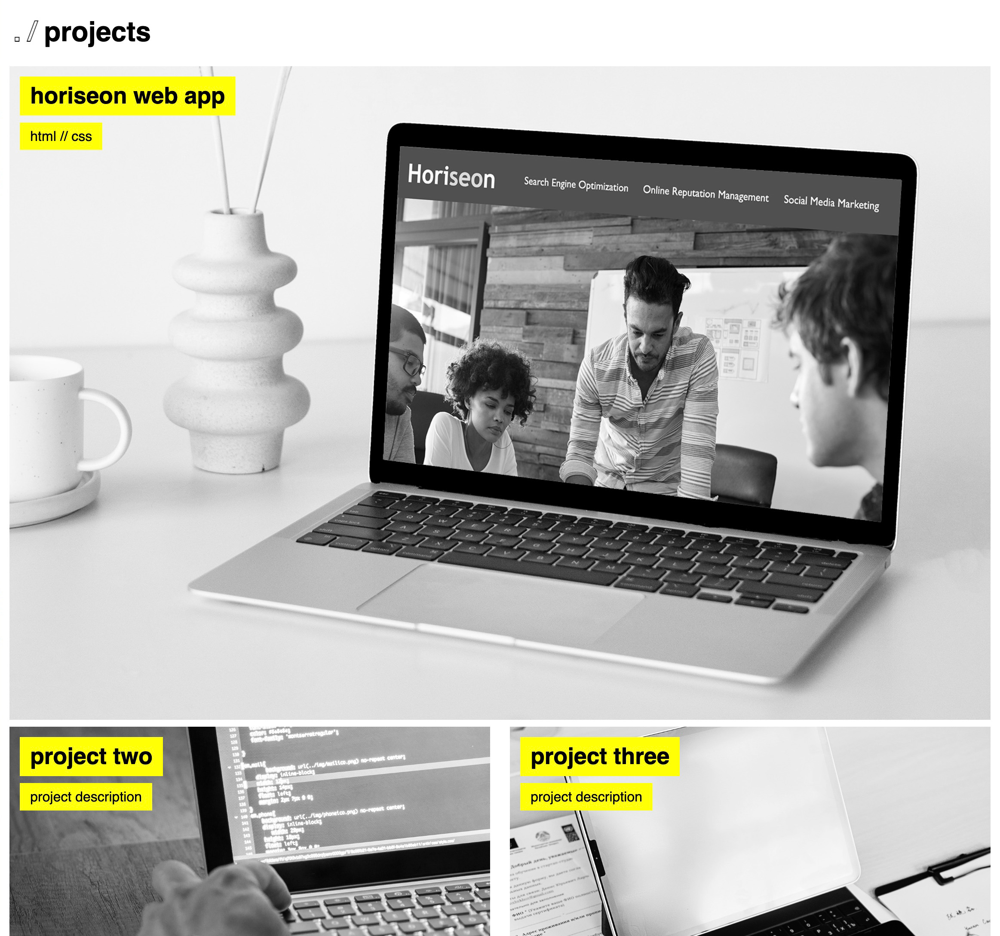
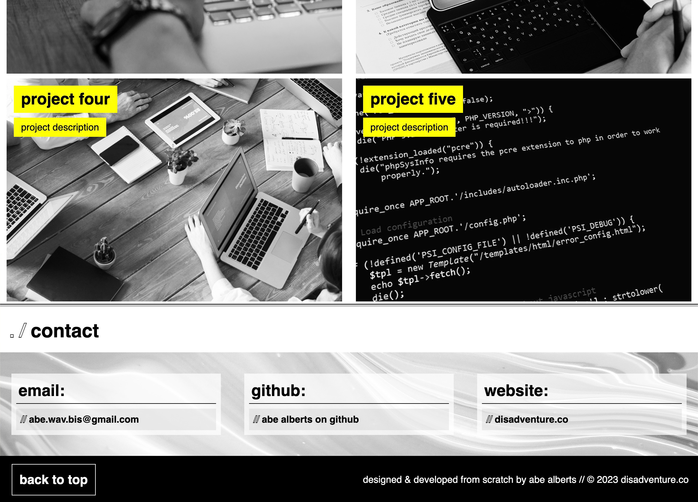

# Personal Web Portfolio

## An online portfolio built from the ground up

This is a web app built to showcase myself as a developer. The site contains details about me, my projects, and how to contact me.

- This site was built to showcase my skillset to potential employers. The web app itself becomes a showcase of talent/vision.

- This site enables interested parties to easily find development projects that I have created or worked on, as well as learn more about me and how to get in touch. This, in theory, will make me a better job candidate during a career search.

- By creating this portfolio, I became more comfortable and confident creating layouts and styling elements. This will be a fun project to update as my skill level grows and I have more impressive work to showcase.

## Usage

### [Visit my online development portfolio by clicking here.](https://abealberts.github.io/aa-webdev-portfolio/)

### Screenshots:

I am always open to feedback and constructive criticism! Do not hesitate to reach out and let me know what you think.

## Credits

### Helpful tutorials/threads I consulted while creating this project:

- [Creating infinite scrolling text with just HTML & CSS](https://www.myoussouf.com/blog/horizontal-scrolling-text-css)

- [Making an HTML container a clickable link with HTML only](https://www.geeksforgeeks.org/how-to-make-the-background-of-a-div-clickable-in-html/)

- [Adding color overlays to background images in CSS](https://stackoverflow.com/questions/18815157/how-to-overlay-image-with-color-in-css)

### Stock image credits:
- Anni Roenkae
- Karsten Madsen
- Anna Nekrashevich
- Mikhail Nilov
- Sora Shimazaki
- Lukas
- Fauxels
- Pixabay

## License

MIT License
